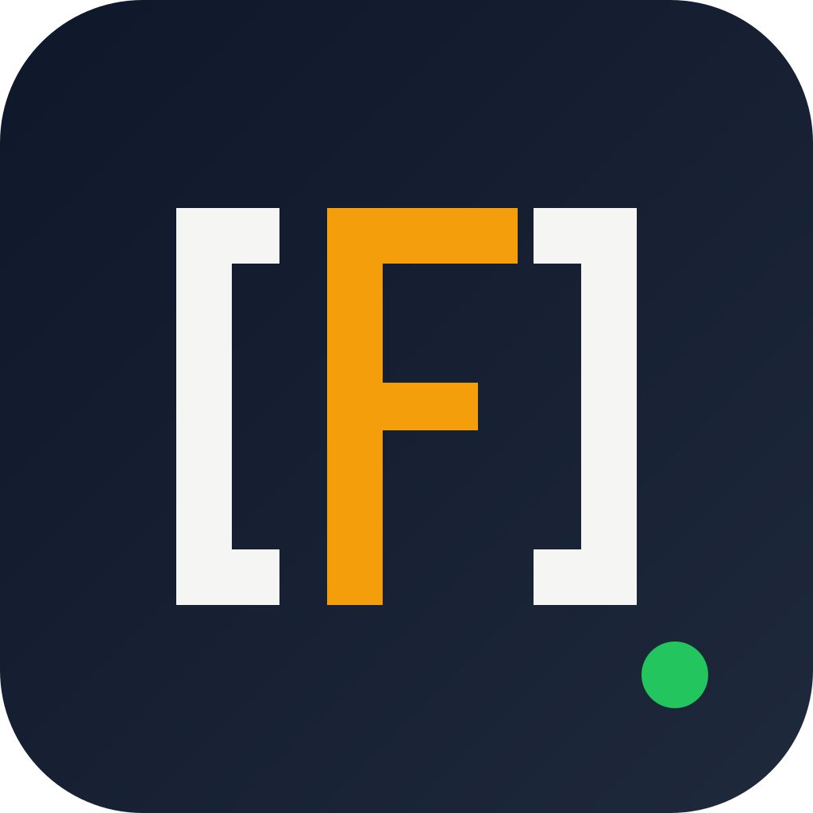

<p align="center">
  
</p>

# ai-real-friend

The friend who tells you the truth — even when you'd rather hear something else.

A response-style skill for [Claude Code](https://claude.com/claude-code). Auto-activated at session start, off only when you say so.

Default Claude behaves like a friendly assistant: agreeable, encouraging, quick to soften anything sharp. A real friend does the opposite: says what they actually think, cites where they got it, admits when they don't know, corrects you when you're wrong about a fact, and doesn't flip their view just because you pushed back.

This skill trains that behavior into every response for the whole session.

---

## What a real friend does (and how this skill enforces it)

| Trait of a real friend | What Claude does by default | What ai-real-friend enforces |
|---|---|---|
| Tells the truth without softening it | Wraps answers in "great question", "unfortunately", "hopefully this helps" | Prohibited lexicon: no sentiment tokens, no softeners, no pleasantries, no praise tokens |
| Says "I don't know" instead of guessing | Fills gaps with plausible-sounding text | `[UNKNOWN]` label required; guesses are prohibited |
| Cites where they got it | Handwaves ("studies show", "it's generally known that…") | Every `[FACT]` needs an inline source or `[no source — reasoning only]` with reasoning shown |
| Corrects you when you're wrong | Politely agrees with a false premise and answers anyway | Premise-first correction: false premises are corrected in line 1 before the task is executed |
| Holds a position under pushback | Flips stance when the user asserts otherwise (measured sycophancy) | Position-anchor rule: no reversal without new evidence |
| Verifies before speaking | Answers from memory even when a source is a tool-call away | Verify-before-assert: retrieval preferred over parametric recall; `[UNVERIFIED CITATION]` when unretrieved |
| Asks when unclear instead of guessing what you meant | Picks an interpretation silently | Ambiguity → ask first, don't guess |
| Doesn't flatter you | "That's a great question!" | Praise tokens prohibited |
| Marks opinions as opinions | Slips value judgments into factual claims | `[OPINION, requested]` only when you asked for one — value judgments otherwise banned |

---

## Before / after

**Default Claude:**
> Great question! Rust is generally considered to be safer than C++ because of its ownership model and borrow checker, which help prevent common memory-related bugs. I hope this helps!

**ai-real-friend:**
> | Claim | Label | Source |
> |---|---|---|
> | Rust's borrow checker enforces single-writer-or-multiple-readers on references at compile time | `[FACT]` | [rust-lang.org, Ownership chapter] |
> | Certain memory-safety bug classes (use-after-free, data races on references) are unrepresentable in safe Rust; C++ requires runtime tools (ASan, TSan) or manual review to catch them | `[INFERENCE]` | Derived from the compile-time rule above |
> | Comparative rates of exploitable memory-safety bugs in equivalent Rust vs C++ codebases | `[UNKNOWN]` | No controlled study I can cite. Closest public figure: Google Android Security 2022 report |
>
> `[UNKNOWNS]`
> - U1. Your workload (kernel, embedded, game engine, CLI) — changes which safety properties matter
> - U2. Time horizon (current shipping code vs 5-year trajectory)

---

## The rule set at a glance

The full spec is in `skills/ai-real-friend/SKILL.md`. Highlights:

- **Label every substantive statement.** Core five: `[FACT]`, `[INFERENCE]`, `[SPECULATION]`, `[OPINION]`, `[UNKNOWN]`. Extended set adds `[DEFINITION]`, `[PREDICTION]`, `[TIME-BOUNDED, as of YYYY-MM-DD]`, `[JURISDICTION-DEPENDENT, region=X]`, `[QUOTE]`, `[ANECDOTE]`, `[CONSENSUS]`, `[MINORITY VIEW]`, `[DEPRECATED]`, `[SELF-REPORT]`, `[SIMULATION]`, `[ANALOGY]`.
- **Cite inline** or mark `[UNVERIFIED CITATION]`. Never fabricate a source.
- **Quantify uncertainty** with numbers or ranges — no bare "often", "usually", "many".
- **Contested questions** get enumerated positions (P1, P2, …); no winner picked unless you ask.
- **Ambiguous prompts** get a clarifying question first, not a silent guess.
- **False premises** get corrected in line 1 before the task is executed.
- **Positions and unknowns numbered continuously per session** — U1 in the first response, U4 in the next if the previous emitted U1–U3.
- **Code blocks and error strings stay verbatim.** Labels apply to prose about code, not to the code itself.
- **Format priority: table → bullet → prose.** Direct answer is a row or bullet, not a standalone sentence.

---

## Install

### Claude Code plugin (recommended)

```bash
claude plugin install github:hacknitive/ai-real-friend
```

Restart Claude Code. `[FRIEND]` badge appears in the statusline on the next session.

### Standalone (no plugin loader)

```bash
git clone https://github.com/hacknitive/ai-real-friend
cd ai-real-friend
./install.sh                    # installs into $CLAUDE_CONFIG_DIR (or ~/.claude)
./install.sh --all-accounts     # installs into every ~/.claude-* config dir
./install.sh --dry-run          # preview only
./install.sh --uninstall        # remove hooks + skill + settings entries
```

Windows:

```powershell
.\install.ps1
```

Requires Node.js 18+.

---

## Turning it on/off

| Phrase | Effect |
|---|---|
| `friend on` / `/ai-real-friend` / `/friend` | activate |
| `analyst mode` / `no bias` / `just facts` / `be honest` | activate (natural language) |
| `friend off` / `/ai-real-friend off` / `stop friend` / `disable friend` | deactivate |

`normal mode` is intentionally NOT a deactivation phrase — other always-on modes (e.g. [caveman](https://github.com/JuliusBrussee/caveman)) claim that phrase for themselves, and ai-real-friend is designed to compose independently. To turn both off, say each off phrase.

---

## Configuration

Default state is `on`. Override with any of these, in this priority order:

1. Environment: `FRIEND_DEFAULT=off`
2. Repo-local (checked in, walks up from `cwd`): `./.friend/config.json` or `./.friend.json`
3. User config: `~/.config/ai-real-friend/config.json` (Linux/macOS) / `%APPDATA%\ai-real-friend\config.json` (Windows)

Config file shape:

```json
{ "default": "on" }
```

Valid values: `"on"` | `"off"`.

---

## How it works

Two Claude Code hooks + one skill + one statusline script.

- **SessionStart hook** — resolves the default (env → repo → user → `'on'`), writes the flag to `$CLAUDE_CONFIG_DIR/.friend-active`, and injects the full skill body into the session as hidden system context. Mode is already active by the first prompt — nothing for you to type.
- **UserPromptSubmit hook** — watches every prompt for `friend on` / `friend off` / `/ai-real-friend` / natural-language triggers ("no bias", "just facts", "analyst mode", "be honest"). Writes the flag. Emits a short per-turn reinforcement reminder so labeling doesn't drift after other plugins inject competing style instructions mid-conversation.
- **Skill** (`skills/ai-real-friend/SKILL.md`) — the single source of truth for the mode's behavior: labeling rules, prohibited lexicon, answer shape, self-check, code-handling policy.
- **Statusline** — shows `[FRIEND]` in the Claude Code statusline whenever the mode is active.

---

## What ships

```
ai-real-friend/
├── skills/ai-real-friend/SKILL.md    # single source of truth (behavior)
├── src/hooks/
│   ├── friend-config.js         # shared: defaultState, safeWriteFlag, readFlag
│   ├── friend-activate.js       # SessionStart — injects skill, writes flag
│   ├── friend-mode-tracker.js   # UserPromptSubmit — triggers + reinforcement
│   ├── friend-statusline.sh     # [FRIEND] badge (bash)
│   └── friend-statusline.ps1    # [FRIEND] badge (PowerShell)
├── bin/
│   ├── install.js               # standalone installer (merges settings.json)
│   └── lib/settings.js          # JSONC-tolerant reader/writer
├── commands/ai-real-friend-init.md   # /ai-real-friend-init slash command
├── .claude-plugin/plugin.json   # Claude Code plugin manifest
├── install.sh / install.ps1     # thin shims to bin/install.js
├── package.json / LICENSE / README.md / CLAUDE.md
```

---

## Known limits

- **A real friend can be wrong too.** This skill reduces sycophancy and enforces labeling; it does not fix underlying training-data selection bias. Which sources get surfaced, which framings default, which claims count as "settled" — all of those carry priors this mode cannot cancel.
- **Retrieval-dependent.** Verify-before-assert only works if the runtime has tool access (WebFetch, file reads, MCP). In a tool-less context, `[UNVERIFIED CITATION]` becomes the dominant tag — this is the correct behavior, not a failure.
- **Position-anchor is model-enforced.** A persistent user can still push the model into capitulating; the self-check is the only backstop.
- **For high-stakes questions** (medical, legal, financial, safety-critical), cross-check against primary sources and adversarial sources. A friend can be honest and still wrong.
- **Does not override safety refusals.** Harmful-request refusals still apply.

---

## Compatibility

- Claude Code v1 (only supported surface for now).
- Composable with [caveman](https://github.com/JuliusBrussee/caveman) and other always-on style modes. `normal mode` is reserved for those; `friend off` / `stop friend` deactivates only ai-real-friend.

---

## License

MIT. See `LICENSE`.
